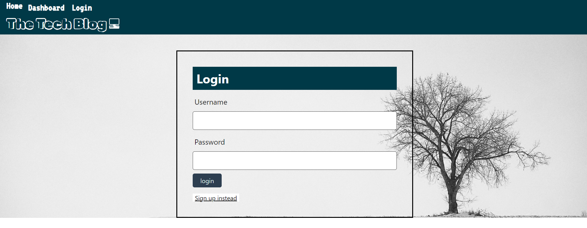
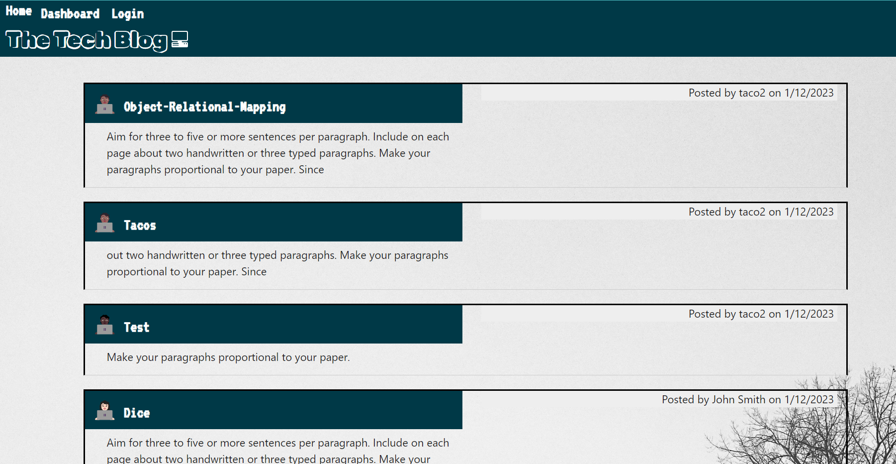
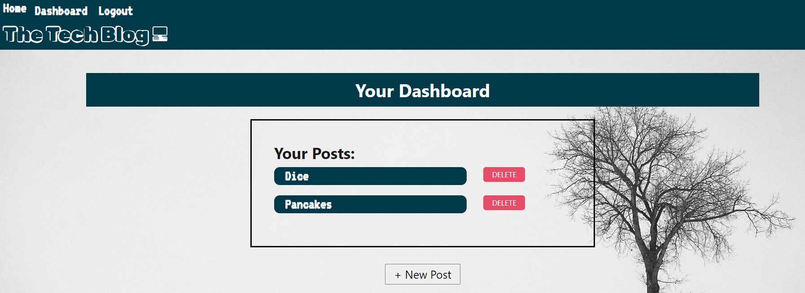
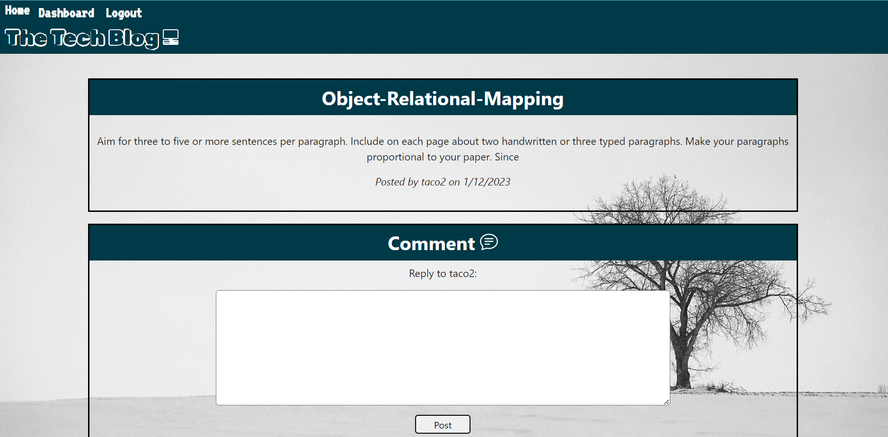

# Tech-Blog

## <section id = "License">License</section>
N/A

## <section id = "Description">Description</section>
This project was made using express, express-session, and express-handlebars and serves as a blog forum where users can login to the site to make posts about the latest tech trends. MySql/JawsDb was used for data persitence, so when someone visits the site, a list of previous posts from the site's users will appear on the home page. The visitor can then sign up and will be allowed to make posts of their own and reply to others who have posted to the site.

Link to heroku application: https://tech-blog1.herokuapp.com/

## Table of Contents
1.) <a href = "#License">License</a> 
2.) <a href = "#Description">Description</a> 
3.) <a href = "#Installation">Installation</a>  
4.) <a href = "#Usage">Usage</a> 
5.) <a href = "#Contributing">Contributing</a> 
6.) <a href = "#Tests">Tests</a> 
7.) <a href = "#Questions">Questions</a>

## <section id = "Installation">Installation</section>
Command to Install Dependencies: npm i, npm i express

## <section id = "Usage">Usage</section>
Using the Repo: N/A 

## <section id = "Contributing">Contributing</section>
Contributing to the Repo: Currently not taking contributions.

## <section id = "Tests">Tests</section>
Command to Run Tests: N/A

## <section id = "Questions">Questions</section>
If you have any questions, please feel free to contact me:   
1.) Github Username: Cgotts1  
2.) Email Address: cobi.gottschalk@gmail.com